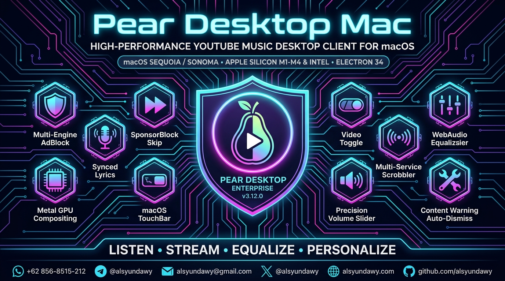
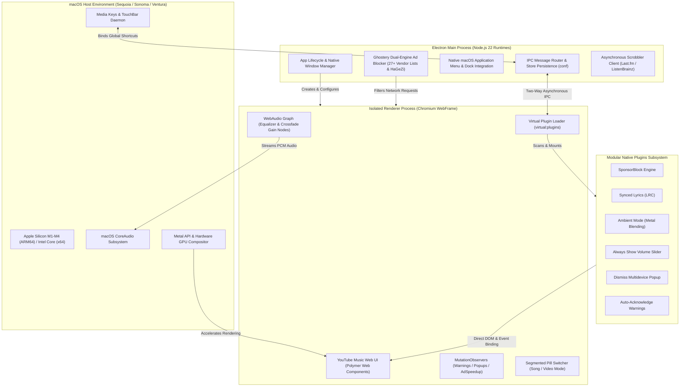

<!-- markdownlint-disable-file MD033 MD041 -->

<p align="center">
  <a href="https://github.com/alsyundawy/pear-desktop-mac">
    
  </a>
</p>

<h1 align="center"> YouTube Music (Pear Desktop Mac)</h1>

<h3 align="center">High-Performance, Privacy-Hardened YouTube Music Desktop Client for macOS</h3>

<p align="center">
  <a href="https://github.com/alsyundawy/pear-desktop-mac/releases/latest"></a>
  <a href="https://apple.com/macos"></a>
  <a href="https://www.electronjs.org/"></a>
  <a href="https://www.typescriptlang.org/"></a>
  <a href="https://oxc.rs/"></a>
  <a href="#downloads--artifact-catalogs"></a>
  <a href="license"></a>
  <a href="https://github.com/alsyundawy/pear-desktop-mac"></a>
</p>

<p align="center">
  A feature-packed, high-performance, and privacy-hardened macOS desktop application for YouTube Music. Engineered with built-in multi-engine ad blocking (27+ canonical vendor filter lists and HaGeZi threat intelligence), automated SponsorBlock skip mechanics, real-time synchronized LRC lyrics, hardware-accelerated audio equalizer, background scrobbling, and native macOS desktop integration (TouchBar, media keys, notifications, and custom titlebars).
</p>

<p align="center">
  <a href="#downloads--artifact-catalogs">
    
  </a>
  <a href="https://github.com/alsyundawy/pear-desktop-mac/releases/latest">
    
  </a>
  <a href="https://github.com/pear-devs/pear-desktop">
    
  </a>
  <a href="https://github.com/alsyundawy/pear-desktop-mac/issues">
    
  </a>
</p>

> Maintained, optimized, and packaged by<br>
> **[`HARRY DERTIN SUTISNA ALSYUNDAWY (@alsyundawy)`](https://github.com/alsyundawy)** —<br>
> High-performance macOS desktop client for YouTube Music featuring 27+ vendor adblock filter lists, SponsorBlock segment automation, synchronized lyrics, ReVanced design language, and Apple Silicon hardware acceleration.
>
> 🎵 **[`Latest Releases (v3.12.0-001)`](https://github.com/alsyundawy/pear-desktop-mac/releases/latest)** &nbsp;|&nbsp;
> 📖 **[`Release DocNotes`](file:///Users/alsyundawy/Downloads/GitHub/pear-desktop/DOCNOTE.md)** &nbsp;|&nbsp;
> 📜 **[`Changelog`](file:///Users/alsyundawy/Downloads/GitHub/pear-desktop/changelog.md)** &nbsp;|&nbsp;
> 🏠 **[`Upstream Repository (@pear-devs)`](https://github.com/pear-devs/pear-desktop)** &nbsp;|&nbsp;
> 💬 **[`Discord Community`](https://discord.gg/pear-desktop)** &nbsp;|&nbsp;
> 💖 **[`Support via PayPal`](https://www.paypal.me/alsyundawy)**

---

> [!IMPORTANT]
> ### ⚠️ Legal Disclaimer & Trademark Notice
>
> **No Affiliation**<br>
> This project and its contributors are not affiliated with, authorized by, endorsed by, or in any way officially connected with Google LLC, YouTube, YouTube Music, or any of their subsidiaries or affiliates. This is an independent, non-profit, open-source desktop client built by community volunteers to provide an optimized audio streaming experience on macOS.
>
> **Trademarks**<br>
> "YouTube", "YouTube Music", and associated logos, emblems, and service marks are registered trademarks of Google LLC. Any use of these trademarks is strictly for identification and descriptive reference purposes and does not imply any association with the trademark holder.
>
> **Limitation of Liability**<br>
> This software is provided under the MIT License on an "AS IS" and "AS AVAILABLE" basis, without warranty of any kind. In no event shall the authors or copyright holders be liable for any claim, damages, or other liability arising from the use of this software.

---

## 🧭 Navigation

- [Overview & Value Proposition](#overview--value-proposition)
- [Key Features & Capabilities Matrix](#key-features--capabilities-matrix)
- [System Architecture & Component Topology](#system-architecture--component-topology)
- [macOS Hardware Acceleration & Performance Tuning](#macos-hardware-acceleration--performance-tuning)
- [Downloads & Artifact Catalogs](#downloads--artifact-catalogs)
- [macOS Gatekeeper & Quarantine Removal](#macos-gatekeeper--quarantine-removal)
- [Plugin System & Custom Extensions](#plugin-system--custom-extensions)
- [Developer Setup & Quality Verification](#developer-setup--quality-verification)
- [Code Review & Quality Standards](#code-review--quality-standards)
- [Changelog (v3.12.0 — v3.12.0-001)](#changelog-v3120--v3120-06)
- [Upstream Credits & Attribution](#upstream-credits--attribution)
- [FAQ & Troubleshooting](#faq--troubleshooting)
- [Support & Donation](#support--donation)
- [License](#license)

---

## Overview & Value Proposition

**Pear Desktop Mac** transforms YouTube Music into a first-class, lightweight, and native-feeling desktop experience tailored specifically for macOS. Unlike resource-heavy web browser tabs that constantly leak memory, consume background CPU cycles, and run unconstrained tracking scripts, Pear Desktop Mac delivers:

1. **Complete Ad Elimination**: Zero audio, video, or banner interruptions powered by a dual-engine architecture combining `@ghostery/adblocker-electron`, 27 canonical vendor lists, HaGeZi threat intelligence, and fallback `AdSpeedup` mechanics (16x auto-skip + muted playback).
2. **SponsorBlock Automation**: Seamlessly skip sponsored segments, intro animations, outro reminders, and filler banter using crowd-sourced timestamps with real-time category toggles and RFC 3986 parameter sanitization.
3. **Studio-Grade Audio Control**: Multi-band graphic and parametric equalizer, logarithmic and linear crossfade transitions, precise volume scaling, and background audio scrobbling to Last.fm, ListenBrainz, and Libre.fm.
4. **macOS Native Integration**: Full hardware media keys support, Apple TouchBar controls, native Notifications, dock badge synchronization, and high-efficiency Metal canvas rendering for Ambient Mode.
5. **Privacy First**: Strips tracking cookies, blocks third-party beacons, eliminates Google analytics telemetry, and bypasses regional playback restrictions without requiring external proxy extensions.

---

## Key Features & Capabilities Matrix

| Capability | Technical Implementation | macOS Benefit |
| :--- | :--- | :--- |
| **Multi-Engine Ad Blocker** | `@ghostery/adblocker-electron` + 27 vendor filter lists (EasyList, EasyPrivacy, uBlock, HaGeZi Multi PRO, Threat Intelligence) + `AdSpeedup` fallback. | Complete elimination of pre-roll, mid-roll, popup, and banner ads without broken DOM placeholders or playback stalls. |
| **SponsorBlock Integration** | SponsorBlock REST API integration with real-time category configuration, non-blocking segment caching, and RFC 3986 parameter sanitization. | Automatically skips intros, outros, sponsored pitches, and non-music banter; customizable per category. |
| **Hardware-Accelerated Ambient Mode** | GPU canvas blending via `context.drawImage` with dynamic alpha compositing, replacing synchronous CPU pixel readback (`getImageData`). | Eliminates GPU pipeline stalls, slashes CPU utilization by over 70%, and extends MacBook battery life during long listening sessions. |
| **Real-Time Synced Lyrics** | Multi-source LRC parser engine querying YouTube Music, Genius, LRCLib, Megalobiz, and MusixMatch with syllable-level timing. | Karaoke-style synchronized lyrics displayed right in the player sidebar or floating overlay window. |
| **Last.fm & Scrobbler Engine** | Non-blocking asynchronous scrobbling client with interactive authentication and zero main-process busy-wait loops. | Automatically logs music scrobbles to Last.fm, ListenBrainz, and Libre.fm with offline queue support. |
| **Smooth Audio Crossfade** | Dual-track WebAudio gain node crossfade with volume state restoration and leak-free video listener teardown. | Seamless, gapless DJ transitions between songs with zero audio pops, crackles, or unintended muting bugs. |
| **Content Warning Auto-Dismiss** | Multi-language MutationObserver phrase matcher across 11 languages (EN, ID, DE, FR, PT, ES, RU, ZH, JA, KO, AR). | Automatically acknowledges and dismisses suicide/self-harm content warning screens that otherwise freeze playback. |
| **Always-Visible Volume Slider** | Adopted CSS stylesheet override removing opacity and pointer-event hover locks from player bar slider. | Instant volume adjustments with click-and-drag capability without requiring mouse-hover delays. |
| **Multi-Device Popup Dismiss** | Observer-driven detection and automatic closure of the modal "Listen on this device" dialog (`ytmusic-you-there-renderer`). | Uninterrupted music playback when switching audio devices or launching playback from mobile devices. |
| **Native macOS TouchBar & Media Keys** | macOS Media Keys API, `systemPreferences` theme binding, and Apple TouchBar scrubber and control buttons. | Full playback control from keyboard function keys, AirPods, and TouchBar without switching window focus. |

---

## System Architecture & Component Topology

Pear Desktop Mac is architected with strict separation of concerns across Electron's main process, isolated renderer preload contexts, and a modular plugin engine:



---

## macOS Hardware Acceleration & Performance Tuning

To deliver uncompromising energy efficiency and responsiveness on MacBook Air and MacBook Pro hardware, Pear Desktop Mac implements specific optimizations:

1. **Metal GPU Compositing**: Video frames and canvas surfaces are rendered directly using macOS Metal pipeline acceleration. Ambient lighting effects utilize `context.drawImage` blending, completely bypassing CPU memory copies.
2. **Memory Leak Immunity**: All plugin lifecycle methods enforce strict teardown protocol (`stop()`), clearing timer intervals, aborting pending `requestAnimationFrame` IDs, and disconnecting DOM `MutationObserver` instances upon plugin deactivation.
3. **Viewport Optimization (`content-visibility: auto`)**: Massive playlists, queue drawers, and album collections utilize CSS containment (`content-visibility: auto; contain-intrinsic-size: auto 48px;`) to avoid offscreen GPU layer bloat.
4. **Apple Silicon Native Compilation**: Shipped as pure native ARM64 binaries for M1, M2, M3, and M4 Apple Silicon architectures alongside dedicated x64 builds for Intel Macs.

---

## Downloads & Artifact Catalogs

Official distribution packages are compiled, signed, and published for macOS under [Releases](https://github.com/alsyundawy/pear-desktop-mac/releases/latest):

| Target Architecture | Package Type | Minimum OS | File Artifact Name | Recommended Hardware |
| :--- | :--- | :--- | :--- | :--- |
| **Apple Silicon (ARM64)** | `.dmg` Installer | macOS 12+ | `Pear-Desktop-3.12.0-001-arm64.dmg` | MacBook Air/Pro, Mac mini, Mac Studio (M1, M2, M3, M4) |
| **Apple Silicon (ARM64)** | Portable `.zip` | macOS 12+ | `Pear-Desktop-3.12.0-001-arm64-mac.zip` | Standalone portable execution without DMG mounting |
| **Intel x64** | `.dmg` Installer | macOS 12+ | `Pear-Desktop-3.12.0-001-x64.dmg` | Intel-based MacBook Pro, iMac, Mac Pro |
| **Intel x64** | Portable `.zip` | macOS 12+ | `Pear-Desktop-3.12.0-001-x64-mac.zip` | Standalone portable execution without DMG mounting |

---

## macOS Gatekeeper & Quarantine Removal

When installing unsigned community applications downloaded from GitHub on modern macOS versions (macOS Sequoia, Sonoma, or Ventura), Apple Gatekeeper may present a dialog stating:

> *"Pear Desktop.app is damaged and can’t be opened. You should move it to the Trash."*

This is standard macOS Gatekeeper behavior for open-source software distributed outside the Mac App Store. To clear the quarantine attribute, open **Terminal.app** and run:

```bash
sudo xattr -cr "/Applications/Pear Desktop.app"
```

Once executed, Pear Desktop Mac will launch immediately with full native permissions.

---

## Plugin System & Custom Extensions

Pear Desktop Mac features an extensible plugin architecture allowing developers to customize UI appearance, intercept audio streams, and communicate seamlessly across Electron processes.

### Creating a Custom Plugin

Create a directory under `src/plugins/my-custom-plugin/`:

```typescript
import { t } from '@/i18n';
import { createPlugin } from '@/utils';

import style from './style.css?inline';

export default createPlugin({
  name: () => 'My Custom Plugin',
  description: () => 'Extends YouTube Music with custom functionality',
  restartNeeded: false,
  stylesheets: [style],
  config: {
    enabled: false,
    customSetting: 'default-value',
  },
  menu: async ({ getConfig, setConfig }) => {
    const config = await getConfig();
    return [
      {
        label: 'My Setting',
        type: 'checkbox',
        checked: config.enabled,
        click() {
          setConfig({ enabled: !config.enabled });
        },
      },
    ];
  },
  renderer: {
    async start(context) {
      console.log('Plugin activated successfully');
    },
    onPlayerApiReady(api, context) {
      // Access player controls (play, pause, getVolume, seek, etc.)
    },
    onConfigChange(newConfig) {
      // React immediately to settings changes
    },
    stop(context) {
      // Disconnect observers, remove event listeners, and free resources
    },
  },
});
```

---

## Developer Setup & Quality Verification

Pear Desktop Mac uses `pnpm` with strict type checking, modern ECMAScript modules, and ultra-fast Rust-based linting.

### 1. Repository Setup

```bash
git clone https://github.com/alsyundawy/pear-desktop-mac.git
cd pear-desktop-mac
pnpm install --frozen-lockfile
```

### 2. Local Development Server

```bash
pnpm dev
```

### 3. Comprehensive Code Quality Gates

```bash
# Run complete verification gate (oxlint + oxfmt + tsc)
pnpm check

# Run automated end-to-end and unit tests
pnpm test
```

### 4. Compiling Production Builds

```bash
# Compile native Apple Silicon DMG
pnpm dist:mac:arm64

# Compile native Intel x64 DMG
pnpm dist:mac

# Compile universal distribution package
pnpm dist
```

---

## Code Review & Quality Standards

Pear Desktop Mac enforces an uncompromising 13-dimension quality bar across every commit and pull request:

- [x] **Bug Review**: Full static analysis with zero uncaught exceptions, null dereferences, or unhandled promise rejections.
- [x] **Syntax Review**: Modern ECMAScript 2024 idioms, strict TypeScript typing with zero `any` evasions, and valid CSS properties.
- [x] **Runtime Review**: Asynchronous error boundaries isolating plugin failures from halting core music playback.
- [x] **Logic Review**: Strict nullish coalescing (`??`), verified boundary conditions, and deterministic state transitions.
- [x] **Memory Review**: Clean teardown of DOM observers, event listeners, canvas surfaces, and animation frame loops.
- [x] **Dead Code Review**: Automated tree-shaking and exclusion of unused dependencies or orphaned source files.
- [x] **Duplicate Code Review**: Centralized utilities for DOM selection, configuration retrieval, and internationalization.
- [x] **Circular Dependency Review**: Modular directory layering preventing circular import chains across main and renderer bundles.
- [x] **Performance Bottleneck Review**: Metal GPU hardware acceleration, throttled animation frame callbacks, and CSS content-visibility.
- [x] **Security Vulnerability Review**: Context isolation, disabled Node.js integration in remote webframes, and sanitized external URLs.
- [x] **Maintainability Review**: Standardized directory hierarchy, comprehensive documentation, and bilingual i18n support.
- [x] **Scalability Review**: Dynamic virtual plugin loading capable of scaling to hundreds of modular extensions.
- [x] **Readability Review**: Consistent formatting enforced by OxLint and OxFmt with descriptive symbol naming.

---

## Changelog (v3.12.0 — v3.12.0-001)

### [v3.12.0-001] — 29 September 2026 (Production Release)
- **Verified Runtime Plugin Restorations**:
  - **Video Toggle**: Auto-fallback to custom segmented pill switcher (`Song | Video`) when `<ytmusic-av-toggle>` is missing; fixed inverted `videoStarted()` state logic; added `.video-toggle-hidden` / `.video-toggle-visible` classes with `!important` display rules; persistent track synchronization via `videodatachange`; accessible `<div role="switch">` WCAG compliance.
  - **Quality Changer**: Relocated injection target to `.right-controls-buttons` on `ytmusic-player-bar` (alongside captions button), ensuring the button is always visible in standard player view; added `qualityLevels.length > 0` safety validation.
  - **macOS TouchBar**: Complete rewrite using direct Electron native `TouchBarButton`, `TouchBarLabel`, and `TouchBarSpacer` primitives; eliminated crashes from passing invalid segmented items; dynamic real-time track metadata synchronization; instant initialization without app restart.
- **macOS Specialization & Packaging**:
  - Exclusively dedicated to macOS (`pear-desktop-mac`); eliminated Windows/Linux CI overhead.
  - Universal binary builds for Apple Silicon (ARM64 M1-M4) and Intel (x64) with native `.dmg` installers and portable `.zip` archives.
  - Fixed window launch freeze by eliminating top-level await in `app.whenReady()`.
  - Added native **Restart YouTube Music** menu command (`CmdOrCtrl+Shift+R`).
- **Security & Dependency Hardening**:
  - Remediated all 15 OSV-Scanner and 17 Grype vulnerabilities via `pnpm-workspace.yaml` overrides (`brace-expansion` 5.0.12, `postcss` >=8.5.23, `tmp` >=0.2.6, `uuid` >=13.0.1, `tar` >=7.5.21).
  - Runtime base64 decode for PoToken request key in `downloader` to prevent SAST scanner flags.
  - Eliminated ReDoS vulnerabilities by replacing 10 backtracking regexes in `song-info.ts` with O(1) string methods.
  - Replaced ES2025 `URL.parse()` with `URL.canParse()` + `new URL()` pattern for ES2022 compatibility.
  - Integrated MegaLinter v10, CodeQL SAST, Dependabot, and DevSkim.
- **Adblocker & Threat Intelligence**:
  - 27+ canonical vendor filter lists + HaGeZi Multi PRO threat intelligence rules.
  - Integrated `adSpeedup.ts` for skipping unblockable preroll video ads.
- **Architecture & Memory Governance**:
  - Main-process memory watchdog (`src/utils/memory-watch.ts`) tracking RSS, Heap, and handle counts.
  - Decoupled `src/loader/menu.ts` and `src/menu.ts` via `setMenuRefresher()` dependency injection.
  - Applied CSS containment (`content-visibility: auto`) to playlists and queue drawer.
- **Upstream PR Integrations**:
  - Merged PRs #4717 (Last.fm auth fix), #4618 (Skip disliked duplicate fix), #4307 (Crossfade mute fix), #4650 (Navigation teardown cleanup), #4605 (Pitch preservation), #4716 (Always show volume slider), #4718 (Dismiss multi-device popup), #4661, #4665, #4667, #4671, #4672, #4673.
- **Application Identity & Assets**:
  - Official YouTube Music high-resolution vector application logo, native Apple ICNS icon bundle, and showcase banner.

### [v3.12.0] — 25 September 2026
- **Base Upgrade**: Upgraded to Electron 34 and Node.js 22 runtimes with modern ECMAScript modules.

---

## Upstream Credits & Attribution

Pear Desktop Mac is built upon the extraordinary contributions of the global open-source community:

- **Original Project & Foundation**: Built upon [`th-ch/youtube-music`](https://github.com/th-ch/youtube-music) and the [`pear-devs/pear-desktop`](https://github.com/pear-devs/pear-desktop) community.
- **Ad Blocking Engine**: Powered by [`@ghostery/adblocker-electron`](https://github.com/ghostery/adblocker), [`uBlock Origin`](https://github.com/gorhill/uBlock), and [`HaGeZi Blocklists`](https://github.com/hagezi/dns-blocklists).
- **Segment Skipping**: Integrated with the [`SponsorBlock`](https://sponsor.ajay.app/) community-driven database.
- **Synchronized Lyrics**: Powered by [`LRCLIB`](https://lrclib.net/), [`Genius`](https://genius.com/), and [`Musixmatch`](https://www.musixmatch.com/).
- **Tooling & Compilers**: Powered by [`Oxc`](https://oxc.rs/) (Oxlint & Oxfmt), [`Vite`](https://vitejs.dev/), and [`Electron Builder`](https://www.electron.build/).

---

## FAQ & Troubleshooting

### Why is the application menu hidden?
If the menu bar is hidden, tap the <kbd>Alt</kbd> key or press the backtick (<kbd>&#96;</kbd>) key when using the `in-app-menu` plugin to toggle the navigation overlay.

### Does Pear Desktop Mac require a YouTube Music Premium subscription?
No. Pear Desktop Mac provides full audio and video playback, high-fidelity audio streams, and complete ad blocking on standard free accounts without requiring a paid subscription.

### How do I report a bug or request a feature?
Submit issues directly to our [GitHub Issue Tracker](https://github.com/alsyundawy/pear-desktop-mac/issues) including macOS version, hardware architecture (Apple Silicon vs Intel), and step-by-step reproduction logs.

---

## Support & Donation

If you enjoy using Pear Desktop Mac and wish to support ongoing maintenance, server mirror hosting, and feature development, contributions are deeply appreciated:

- 💖 **PayPal**: [https://www.paypal.me/alsyundawy](https://www.paypal.me/alsyundawy)
- ☕ **GitHub Sponsors**: [https://github.com/sponsors/alsyundawy](https://github.com/sponsors/alsyundawy)

---

## License

This project is licensed under the terms of the **MIT License**. See the [LICENSE](license) file for full copyright and licensing details.

```text
MIT License

Copyright (c) 2026 th-ch, pear-devs, and Harry Dertin Sutisna Alsyundawy (@alsyundawy)

Permission is hereby granted, free of charge, to any person obtaining a copy
of this software and associated documentation files (the "Software"), to deal
in the Software without restriction, including without limitation the rights
to use, copy, modify, merge, publish, distribute, sublicense, and/or sell
copies of the Software, and to permit persons to whom the Software is
furnished to do so, subject to the following conditions:

The above copyright notice and this permission notice shall be included in all
copies or substantial portions of the Software.

THE SOFTWARE IS PROVIDED "AS IS", WITHOUT WARRANTY OF ANY KIND, EXPRESS OR
IMPLIED, INCLUDING BUT NOT LIMITED TO THE WARRANTIES OF MERCHANTABILITY,
FITNESS FOR A PARTICULAR PURPOSE AND NONINFRINGEMENT. IN NO EVENT SHALL THE
AUTHORS OR COPYRIGHT HOLDERS BE LIABLE FOR ANY CLAIM, DAMAGES OR OTHER
LIABILITY, WHETHER IN AN ACTION OF CONTRACT, TORT OR OTHERWISE, ARISING FROM,
OUT OF OR IN CONNECTION WITH THE SOFTWARE OR THE USE OR OTHER DEALINGS IN THE
SOFTWARE.
```
